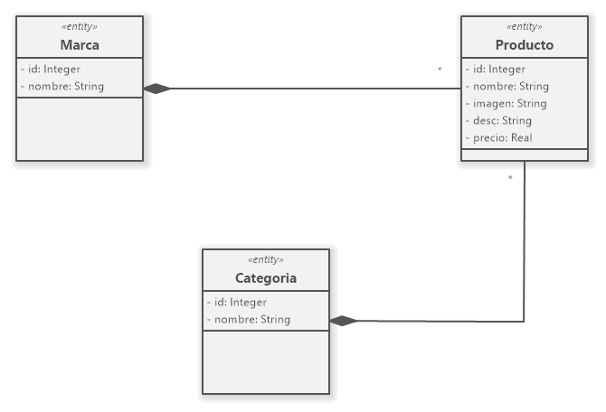

<table>
    <tr>
        <td>
            
        </td>
        <td>
        </td>
    </tr>
</table>

# LaTiendaPHP - Factories y Seeders

Laravel Provee dos tipos de componentes auxiliares para facilitar la prueba de aplicacionesbasadas en bases de datos:

- Factory: Permite establecer un conjunto predeternimado de tipos de valores, para cada uno de los atributos de una **entidad**, utilizando el componente utilitario [Faker](https://fakerphp.github.io/formatters/)

- Seeder: Las Componentes o clases **semilla** permiten "sembrar" la base de datos con determinado número de datos de prueba basados en Factories. 

## Prerrequsitos

-   PHP versión 8.\*
-   **Gestor de dependencias**: Composer 2.\*
-   Base de datos **Mysql** o **MariaDB**
-   Crear una base de Datos en el motor anterior, llamada: _latiendaphp_

## Instalación

Ingresar en el prompt de una terminal:

    composer create-project laravel/laravel latiendaPHP

## Configuración

En el archivo **.env** , modificar las lineas correspondiente a la conexión a base de datos(a continuación un ejemplo para **XAMPP**):

    DB_CONNECTION=mysql
    DB_HOST=127.0.0.1
    DB_PORT=3306
    DB_DATABASE=laTiendaPHP
    DB_USERNAME=root
    DB_PASSWORD=

## Primeros Pasos:

Dado el siguiente modelo de dominio actualizado:

Crearemos en primer lugar los _modelos_ y sus componentes auxiliares(**Factory** y **Seeder**)n en el siguiente orden:

    php artisan make:model Marca -mfs
    php artisan make:model Categoria -mfs
    php artisan make:model Producto -mfs

A continuación crearemos atributos en cada migración:

_create_marcas_table_

    Schema::create('marcas', function (Blueprint $table) {
            $table->id();
            $table->string("nombre");
            $table->timestamps();
        });

_create_categorias_table_

    Schema::create('categorias', function (Blueprint $table) {
            $table->id();
            $table->string("nombre");
            $table->timestamps();
        });

_create_productos_table_

    Schema::create('productos', function (Blueprint $table) {
            $table->id();
            $table->string("nombre");
            $table->text("imagen");
            $table->longText("desc");
            $table->decimal('precio', $precision = 8, $scale = 2);
            $table->foreignId('marca_id')->constrained();
            $table->foreignId('categoria_id')->constrained();
            $table->timestamps();
        });
